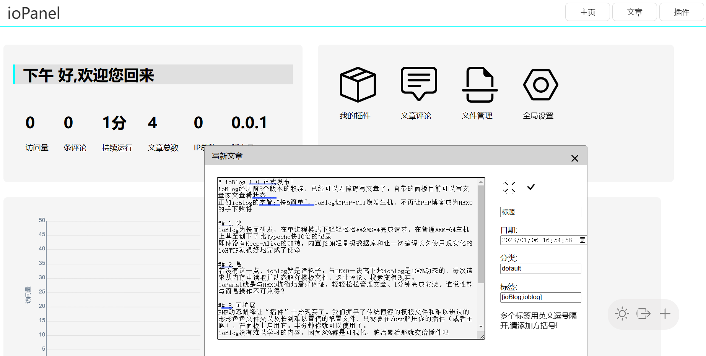
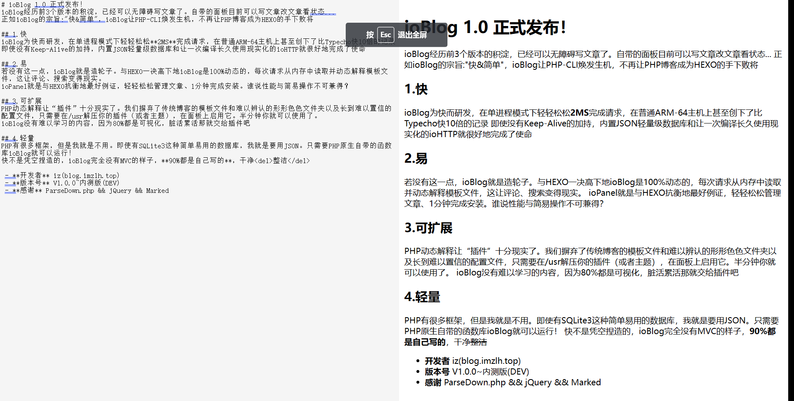
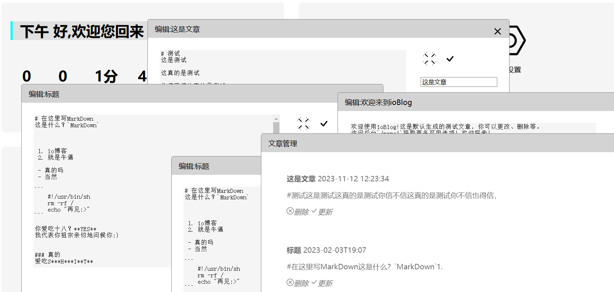

# ioBlog
ioBlog -- 极少依赖，纯PHP-CLI开发的高效博客程序
ioBlog经历前3个版本的积淀，已经可以无障碍写文章了。自带的面板目前可以写文章改文章看状态...
正如ioBlog的宗旨:"快&简单"，ioBlog让PHP-CLI焕发生机，不再让PHP博客成为HEXO的手下败将

## 1.快
ioBlog为快而研发，在单进程模式下轻轻松松**2MS**完成请求，在普通ARM-64主机(10ms)上甚至创下了比Typecho快10倍(opcache下120ms)的记录
即使没有Keep-Alive的加持，内置JSON轻量级数据库和让一次编译长久使用现实化的ioHTTP就很好地完成了使命

## 2.易
若没有这一点，ioBlog就是造轮子。与HEXO一决高下地ioBlog是100%动态的，每次请求从内存中读取并动态解释模板文件，这让评论、搜索变得现实。
ioPanel就是与HEXO抗衡地最好例证，轻轻松松管理文章、1分钟完成安装。谁说性能与简易操作不可兼得？

## 3.可扩展
PHP动态解释让“插件”十分现实了。我们摒弃了传统博客的模板文件和难以辨认的形形色色文件夹以及长到难以置信的配置文件，只需要在/usr解压你的插件（或者主题），在面板上启用它。半分钟你就可以使用了。
ioBlog没有难以学习的内容，因为80%都是可视化，脏活累活那就交给插件吧

## 4.轻量
PHP有很多框架，但是我就是不用。即使有SQLite3这种简单易用的数据库，我就是要用JSON。只需要PHP原生自带的函数库ioBlog就可以运行！
快不是凭空捏造的，ioBlog完全没有MVC的样子，**90%都是自己写的**，干净<del>整洁</del>

 - **开发者** iz(blog.imzlh.top)
 - **版本号** V0.1.0~内测版(DEV)
 - **感谢** ParseDown.php && jQuery && Marked
 
 预览?
 
  
   
